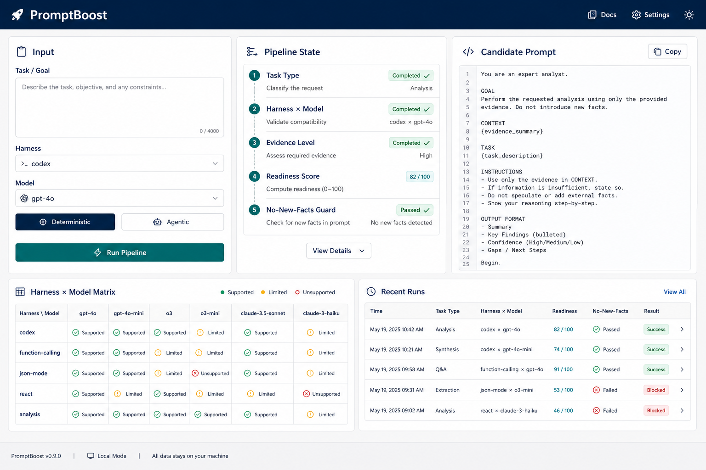

# PromptBoost

**Local prompt compiler and eval logger for personal prompt work.**

PromptBoost reads PromptGarage examples read-only, accepts a raw prompt, selects task/harness/model rules, generates a deterministic boosted prompt, runs a local no-new-facts check, and stores boost runs in `promptboost.db`.

[](https://github.com/smlfg/promptboost)
[](https://www.python.org/)
[](https://fastapi.tiangolo.com/)


## What it does

PromptBoost is a **local-first prompt compiler**. It does not call paid LLM APIs in the default path.

1. **PromptGarage (read-only)** — If a PromptGarage SQLite database is available, the UI can browse sample prompts via immutable/read-only connections. PromptGarage is never modified.
2. **Boost** — A raw prompt is classified, expanded into a task spec, and merged with harness runtime rules and model adapter rules into a structured candidate prompt.
3. **No-new-facts guard** — A conservative, deterministic check flags suspected domain facts that were not present in the raw prompt. This is a warning gate, not semantic proof.
4. **SQLite logging** — Every boost run (deterministic or agentic) is persisted locally in `promptboost.db` with scores, warnings, and full result JSON.

## Features

- **Deterministic pipeline** — Same input + harness + model always produces the same boosted prompt.
- **Task classification** — Keyword-based detection across six task types (`coding_patch`, `research_synthesis`, `document_summary`, `structured_extraction`, `strategic_memo`, `general_agent_task`).
- **Harness × model matrix** — 10 harness profiles × 10 model families with JSON rule packs under `promptboost/rules/`.
- **Input adequacy scoring** — Flags underspecified prompts and caps readiness scores when clarification is needed.
- **Readiness heuristic** — Structure/guardrail score (not a model benchmark) with evidence-level visibility.
- **Local web UI** — FastAPI + Jinja2 workspace at `/` with pipeline state, matrix grid, run history, and PromptGarage samples.
- **Matrix Lab** — `/matrix-lab` for exploring harness × model combinations.
- **Optional agentic prepass** — `/boost/agentic` runs an OpenAI-compatible LLM extraction step, then still compiles through the deterministic pipeline.
- **REST API** — `POST /boost`, `GET /api/runs`, `GET /api/promptgarage/samples`, `GET /health`, and more.



## Quick start

Requires [uv](https://docs.astral.sh/uv/) and Python ≥ 3.11.

```bash
git clone https://github.com/smlfg/promptboost.git
cd promptboost
uv run uvicorn promptboost.main:app --reload --port 8000
```

Open [http://127.0.0.1:8000](http://127.0.0.1:8000).

### Optional environment variables

| Variable | Default | Purpose |
|----------|---------|---------|
| `PROMPTBOOST_DB_PATH` | `./promptboost.db` | Local SQLite path for boost run logs |
| `PROMPTGARAGE_DB_PATH` | `/home/smlflg/Projekte/PromptGarage/prompts.db` | Read-only PromptGarage database |

### API example

```bash
curl -s -X POST http://127.0.0.1:8000/boost \
  -H 'Content-Type: application/json' \
  -d '{"raw_prompt":"Fix the failing pytest in auth.py","target_harness":"codex","target_model":"gpt"}'
```

## Agentic mode

The deterministic `POST /boost` route is the default. The optional `POST /boost/agentic` route runs an OpenAI-compatible LLM prepass first: it extracts a structured task draft (goal, inputs, deliverables, constraints, open questions), validates it with the no-new-facts guard, then compiles through the same deterministic pipeline. If the LLM is unavailable, returns invalid JSON, or adds suspected new facts, PromptBoost **falls back to deterministic boost** and records the fallback in `agentic` metadata.

```bash
export PROMPTBOOST_LLM_API_KEY=...
export PROMPTBOOST_LLM_BASE_URL=https://api.openai.com/v1
export PROMPTBOOST_LLM_MODEL=gpt-5.4-mini
# optional:
export PROMPTBOOST_LLM_TIMEOUT_SECONDS=20
```

Agentic mode requires `PROMPTBOOST_LLM_API_KEY`. No paid LLM APIs are called unless you explicitly use `/boost/agentic` or the Matrix Lab full-cell endpoint.

## Architecture

```
Raw Prompt
    │
    ├─► Task classification (keyword heuristics)
    ├─► Task spec extraction (goal, deliverables, constraints, adequacy)
    ├─► Harness policy + model adapter (JSON rule packs)
    ├─► Prompt assembly (concise / guarded XML / phased templates)
    ├─► No-new-facts guard (deterministic token/claim check)
    └─► SQLite persistence (promptboost.db)
```

Optional agentic branch: OpenAI-compatible LLM → validated task draft → same pipeline above.

See [docs/ARCHITECTURE.md](docs/ARCHITECTURE.md) for component details and [docs/images/promptboost-pipeline.png](docs/images/promptboost-pipeline.png) for the visual flow.

## Project layout

```
promptboost/
├── promptboost/
│   ├── main.py           # FastAPI app, routes, web UI
│   ├── pipeline.py         # Deterministic boost pipeline
│   ├── agentic.py          # Optional LLM prepass + fallback
│   ├── promptgarage.py     # Read-only PromptGarage access
│   ├── db.py               # SQLite boost run persistence
│   ├── matrix_eval.py      # Harness × model matrix helpers
│   ├── rules/              # Task types, harnesses, models (JSON)
│   ├── templates/          # Jinja2 HTML (index, matrix_lab)
│   └── static/             # CSS + client JS
├── tests/
├── docs/
│   ├── README.md
│   ├── ARCHITECTURE.md
│   └── images/
├── pyproject.toml
└── README.md
```

## Tests

```bash
uv run pytest
```

Test coverage includes the pipeline, no-new-facts guard, harness adapters, API routes, agentic fallback, PromptGarage access, and SQLite persistence.

## Design notes and limitations

- **Deterministic by default** — v0.1.1 does not call external LLMs unless agentic mode is used.
- **Conservative no-new-facts gate** — Flags suspicious tokens and numeric claims; does not prove semantic faithfulness.
- **Heuristic scoring** — Readiness and structure scores measure prompt shape and guardrail coverage, not real model output quality.
- **PromptGarage is optional** — The app runs without it; samples simply return empty.
- **Rule packs are hypotheses** — Harness and model evidence levels (`hypothesis`, `inferred`, `documented`, `eval_backed`) are declared in JSON, not verified at runtime.

## Documentation

- [docs/README.md](docs/README.md) — Documentation index
- [docs/ARCHITECTURE.md](docs/ARCHITECTURE.md) — Pipeline and component overview
