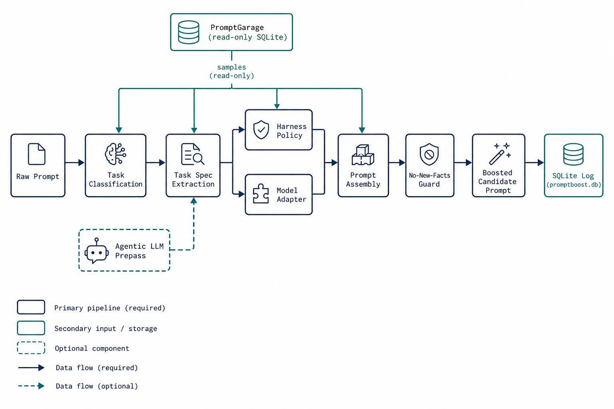

# Architecture

PromptBoost v0.1.1 is a local FastAPI application with a deterministic prompt compilation core and optional LLM-assisted prepass.

## Pipeline stages

### 1. Input and normalization

`POST /boost` accepts `raw_prompt`, `target_harness`, and `target_model`. Harness and model IDs are normalized via `adapters.py` and loaded from JSON rule packs in `promptboost/rules/`.

### 2. Task classification

`classify_task()` scores keyword matches against six task types defined in `rules/task_types.json`. Ties are resolved by a fixed priority order; ambiguous or empty input defaults to `general_agent_task`.

### 3. Task spec extraction

`extract_task_spec()` derives:

- Goal (first sentence heuristic)
- Observed deliverables and constraints from the raw text
- Suggested scaffolding from task-type defaults (not treated as user facts)
- Input adequacy status (`adequate`, `needs_clarification`, `blocked`)

### 4. Prompt assembly

`assemble_prompt()` chooses a template strategy based on harness/model:

| Strategy | Used for |
|----------|----------|
| Concise (markdown sections) | Default |
| Guarded (XML) | `opencode`, `multi_agent_orchestrator`, `minimax` |
| Phased (`<context>` / `<method>` / `<rules>` / `<output>`) | `claude_code`, `claude` |

The output is a **candidate prompt** with explicit sections for raw task boundary, task spec, harness policy, model adapter, evidence notes, and verification gates.

### 5. No-new-facts guard

`evaluate_no_new_facts()` compares meaningful tokens between raw and boosted prompts. Terms from adapter rules and a generic allowlist are permitted. Suspected new facts include domain terms, capitalized proper nouns, and new numeric claims. Failure adds warnings and sets `no_new_facts_passed=false`; it does not block persistence.

### 6. Scoring and eval plan

`calculate_readiness_score()` produces a 0–100 heuristic based on deliverables, quality gates, adapter rules, evidence levels, guard pass/fail, and input adequacy caps. `build_eval_plan()` describes the rubric metadata stored with each result.

### 7. Persistence

`save_boost_run()` writes to `promptboost.db` (configurable via `PROMPTBOOST_DB_PATH`). Each row stores the full `BoostResult` JSON plus indexed columns for querying recent runs.

## Agentic branch

`agentic.py` implements an optional prepass:

1. Call OpenAI-compatible `/chat/completions` with `temperature=0` and JSON response format.
2. Parse and validate an `AgenticTaskDraft` (Pydantic).
3. Run no-new-facts check on the draft text.
4. Append validated draft to the deterministic candidate via `append_agentic_task_draft()`.
5. On any failure, fall back to pure deterministic boost and record `agentic.status=fallback`.

Environment: `PROMPTBOOST_LLM_API_KEY`, `PROMPTBOOST_LLM_BASE_URL`, `PROMPTBOOST_LLM_MODEL`, `PROMPTBOOST_LLM_TIMEOUT_SECONDS`.

## PromptGarage integration

`promptgarage.py` opens the external PromptGarage SQLite database with `immutable=1` and `PRAGMA query_only=ON`. The UI exposes samples at `GET /api/promptgarage/samples`; absence of the database is non-fatal.

## Web layer

| Route | Purpose |
|-------|---------|
| `GET /` | Main workspace UI |
| `GET /matrix-lab` | Harness × model matrix explorer |
| `POST /boost` | Deterministic boost |
| `POST /boost/agentic` | Agentic boost |
| `POST /api/matrix/deterministic` | Matrix deterministic cell |
| `POST /api/matrix/full-cell` | Matrix agentic cell |
| `GET /api/runs` | Recent boost runs |
| `GET /health` | Version and availability probe |

Static assets live in `promptboost/static/`; templates in `promptboost/templates/`.

## Rule packs

- **Harnesses** (10 active): `browser_research`, `ci_debug_agent`, `claude_code`, `cloud_sandbox`, `codex`, `ide_assistant`, `multi_agent_orchestrator`, `no_tools_chat`, `opencode`, `tool_calling_agent`
- **Models** (10): `claude`, `deepseek`, `gemini`, `glm`, `gpt`, `kimi`, `llama`, `minimax`, `mistral`, `qwen`

Each JSON file declares rules, verification gates, failure modes, evidence level, and optional source references.
